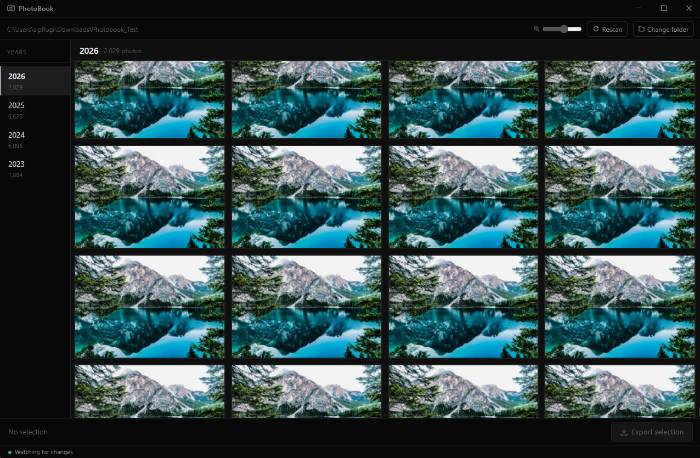

# PhotoBook

A fast, lightweight Windows desktop app for curating and exporting photos by year — built for photo book workflows.

Browse tens of thousands of photos organized by the year they were taken, select the ones you want, and export them to a folder ready for upload to any photo book service.

> This app was developed with the help of Claude (AI) from Anthropic.



## Features

- **Browse by year** — photos are automatically grouped by EXIF date (falls back to file modification date)
- **Fast grid** — virtual rendering handles 10,000+ images without slowdown; zoom from thumbnail to large preview with the slider
- **Smart selection** — click to select, shift-click for ranges, per-year deselect
- **Year-scoped export** — export only the selected photos of the currently viewed year; switch years to export another set
- **Background indexing** — incremental scan on startup picks up new, modified, and deleted files without a full rescan
- **Live file watching** — changes made by other apps are detected and synced automatically (60-second debounce)
- **Parallel thumbnail generation** — thumbnails are generated in the background using all CPU cores; progress shown inline
- **Conflict-safe export** — duplicate filenames are automatically renamed (`photo_1.jpg`, `photo_2.jpg`, …)
- **Persistent selections** — selections survive restarts; stored in a local SQLite database

## Requirements

- Windows 10/11 x64
- [WebView2 Runtime](https://developer.microsoft.com/en-us/microsoft-edge/webview2/) (included in Windows 11; auto-installed by the NSIS installer on Windows 10)

## Installation

Download the latest `PhotoBook_x.x.x_x64-setup.exe` from the [Releases](https://github.com/spflugi/photobook/releases) page and run it.

## Usage

1. Launch PhotoBook and click **Choose Folder** to point it at your photo library root.
2. Wait for the initial scan and thumbnail generation to complete (shown in the status bar).
3. Click a year in the sidebar to browse its photos.
4. Click photos to select them. Shift-click to select a range.
5. Use **Show selected** to filter to your picks.
6. Click **Export selection** to copy the selected photos for that year to a destination folder.
7. Switch years and repeat as needed.

## Building from source

### Prerequisites

- [Rust](https://rustup.rs/) 1.83+ with the `x86_64-pc-windows-msvc` target
- [Node.js](https://nodejs.org/) 18+
- Visual Studio 2022+ with the **Desktop development with C++** workload
- [NSIS](https://nsis.sourceforge.io/) (for building the installer)

### Development

Use `build.ps1` — it auto-detects your Visual Studio installation and sets up the correct MSVC linker environment:

```powershell
# Hot-reload dev server
.\build.ps1

# Debug build + installer
.\build.ps1 -Mode debug

# Optimised release build + installer
.\build.ps1 -Mode release
```

> **Note:** Direct `npm run tauri dev` only works inside an **x64 Native Tools Command Prompt for VS** where `vcvarsall.bat x64` has already been run.

### Type checking (no build needed)

```bash
npx tsc --noEmit
cargo check --manifest-path src-tauri/Cargo.toml
```

## Tech stack

| Layer | Technology |
|---|---|
| Desktop shell | Tauri v2 (Rust + WebView2) |
| Frontend | React 18, TypeScript, Vite 6 |
| Styling | Tailwind CSS v3 (dark zinc/slate palette) |
| Virtual grid | TanStack Virtual v3 |
| State | Zustand v5 |
| Database | SQLite via rusqlite (WAL mode) |
| Image processing | `image` crate + rayon (parallel) |
| EXIF | kamadak-exif |
| File watching | notify-debouncer-mini |

## Project structure

```
src/                        # React frontend
  components/               # UI components (Layout, PhotoGrid, SelectionBar, …)
  hooks/                    # useScanner, usePhotos, useExport
  store/appStore.ts         # Zustand global state
  lib/tauri.ts              # Typed wrappers for all Tauri commands

src-tauri/src/              # Rust backend
  db.rs                     # SQLite schema and queries
  scan.rs                   # Full + incremental folder scan
  thumbnails.rs             # Parallel thumbnail generation
  export.rs                 # Parallel file copy with conflict resolution
  watcher.rs                # Debounced filesystem watcher
  lib.rs                    # Tauri setup and command registration
```

## Data storage

All app data is stored in `%APPDATA%\PhotoBook\`:

| File | Contents |
|---|---|
| `db.sqlite` | Photo index, selections, settings |
| `thumbnails\` | Cached 240×240 JPEG thumbnails (keyed by SHA-256 of path) |

## License

[MIT](LICENSE)
